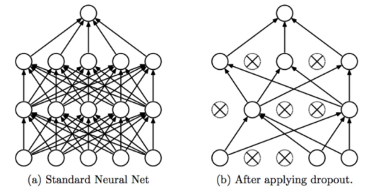
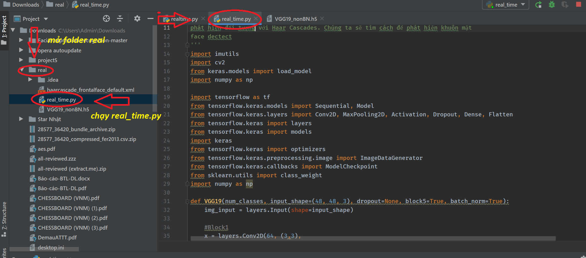
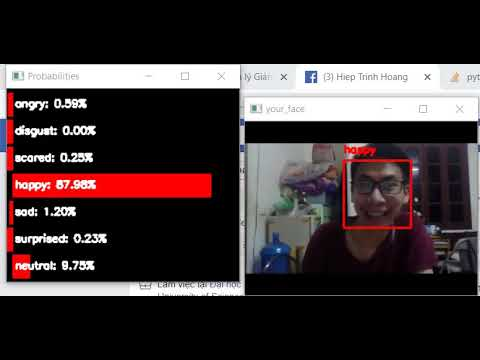

# Tài liệu hướng dẫn sử dụng

**I. MỤC TIÊU**

*I.1. Đặt vấn đề*

Trong những năm gần đây, cùng với sự phát triển của khoa học công nghệ, tương tác người máy đã giành được nhiều sự quan tâm. Để có thể tương tác tốt, máy móc cần có khả năng trao đổi thông tin với con người, và một trong những khả năng đó là khả năng nhận diện cảm xúc của con người. Dựa vào cảm xúc, máy móc có thể phán đoán hành vi và đưa ra tương tác hợp lý.

Cảm xúc của một người được biểu lộ tốt nhất qua khuôn mặt. Vì vậy em đã chọn đề tài “Nhận diện cảm xúc khuôn mặt”.

*I.2. Mô tả bài toán*

Đầu vào là hình ảnh tĩnh hoặc hình ảnh thời gian thực của một khuôn mặt người.

Đầu ra của bài toán là kết quả phân tích cảm xúc của khuôn mặt đó.

Mục tiêu của bài toán này là sử dụng deep-learning để nhận diện cảm xúc của con người, nó sử dụng hữu ích trong các bài toán thực tế như giám sát học sinh trong lớp, giám sát xe tài xế xe tải và điều trị bệnh nhân,…

**II. CÔNG NGHÊ SỬ DỤNG**

Bài toán này là một bài toán xử lý ảnh, và qua phân tích, em đã nghĩ tới việc sử dụng các kỹ thuật Học sâu, cụ thể là CNN để giải quyết bài toán này. Việc phân loại, gán nhãn cảm xúc ta có thể sử dụng nhiều thuật toán học máy như: SVM, logistic regression,... Tuy nhiên để nâng cao độ chính xác cũng như phù hợp với môn học này, chúng em đã sử dụng mô hình mạng CNN cụ thể là VGG19 và ResNet50 để thực hiện phân loại, gán nhãn cảm xúc của ảnh.

Trong quá trình cài đặt, em có sử dụng một vài kỹ thuật tiên tiến để cải thiện chất lượng mô hình như sau:

- Tăng cường dữ liệu: sau khi tải bộ dữ liệu có sẵn trên kaggle về thì em có nhận xét là dữ liệu không đồng đều, nhãn có nhiều dữ liệu trong khi có nhãn lại có ít dữ liệu, cho nên em đã sử dụng biện pháp tăng cường dữ liệu để làm giàu dữ liệu sẵn có bằng cách sinh ra ảnh thông qua lật trái, lật phải bức ảnh, quay ảnh 1 góc ngẫu nhiên từ 0-40 độ để bài toán có thể có nhiều dữ liệu hơn, ngoài ra em cũng đánh trọng số cân bằng giữa các nhãn của dữ liệu để tránh trường hợp học tủ.

- Batch Normalize: Batch Normalize sẽ chuẩn hóa các feature vector (đầu ra của mỗi layer sau khi đi qua hàm activation) về trạng thái **zero-mean** với độ lệch chuẩn bằng 1. Nhờ vậy mà có thể tránh được hiện tượng weight rơi vào **khoảng bão hòa** (các weight sẽ không được học)  sau khi đi qua các hàm kích hoạt. Bên cạnh đó Batch Normalize còn đóng vai trò như một regularization từ đó có thể tránh được hiện tượng overfitting. Sau mỗi một block trong quá trình huấn luyện thì em đều sử dụng kỹ thuật này và có đánh dấu về việc có sử dụng hay là không sử dụng trong các phiên bản khác nhau, nhìn chung khi sử dụng lớp batch normalize thì cho ra kết quả tích cực hơn so với không sử dụng hàm này.

- Dropout: Dropout là kỹ thuật loại bỏ bớt một số node trong layer trong khi train với tỉ lệ là p%. Việc loại bỏ các node đó khiến cho quá trình train không quá phức tạp và model không quá phụ thuộc vào bất kỳ một node của layer trước mà thay vào đó có xu hướng trải đều weights. Chính vì vậy dropout có thể giúp chúng ta tránh khỏi được overfitting. Em cũng sử dụng kỹ thuật dropout trong phần huấn luyện để giảm thời gian huấn luyện, từ 1 phút trên 1 epochs thì bây giờ sau khi sử dụng dropout bằng 0.5 thì thời gian huấn luyện giảm xuống xấp xỉ chỉ còn trung bình 30s trên 1 epochs.

**III. HƯỚNG DẪN CÀI ĐẶT**

- Đầu tiên chúng ta chạy file download.py để download bộ dữ liệu từ kaggle về máy tính.

- Sau đó chúng ta sẽ chạy file setup.py để tiền xử lý dữ liệu chuẩn bị cho quá trình training

- Thiết lập 2 mô hình trong file resnet.py và file vgg.py.

- Chạy file training.py để bắt đầu quá trình huấn luyện, trọng số được lưu sang file

**IV. HƯỚNG DẪN SỬ DỤNG**

- Sau khi huấn luyện trên google colab thì em thu được bộ trọng số tốt nhất là sử dụng mạng VGG 19, sau đó lưu weights vào trong file h5 để đưa vào chương trình sử dụng.

**Cách sử dụng:**

+ Bước 1: Mở Folder real, trong đó chạy file realtime.py. Cài đặt thêm các thư viện nếu thiếu.

+ Bước 2: Sau khi hoàn thành các bước trên, chỉ cần chạy file realtime.py là chương trình sẽ bắt đầu hoạt động.(lưu ý có thể phải đợi trong khoảng 1 phút vì chương trình có thể chạy khá lâu).

**Lưu ý**: Trong quá trình chạy, không để các chương trình khác sử dụng camera của máy tính vì như vậy opencv sẽ không thể hoạt động cùng lúc được.

**V. Video Demo**

